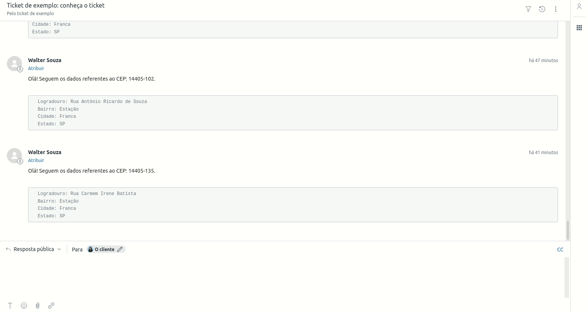

 
  

&#xa0;

  <!-- <a href="https://testecxapppl.netlify.app">Demo</a> -->

<h1 align="center">Teste CX APP PL</h1>

  

  

  

    

<a href="#dart-brieffing">Brieffing</a> &#xa0; | &#xa0;
  <a href="#dart-about">About</a> &#xa0; | &#xa0;   
  <a href="#sparkles-features">Features</a> &#xa0; | &#xa0;  
  <a href="#memo-license">License</a> &#xa0; | &#xa0;
  <a href="https://github.com/wsasouza" target="_blank">Author</a>

 

## :🕵🏽‍♂️: Brieffing

O que você precisa fazer?
Fork desse repositório, commitar todas as alterações ao decorrer do desenvolvimento.
Alterar o manifest, para que o APP fique disponível ao invés da barra lateral de usuário, fique na página de tickets.
Criação de um campo de texto e botão que atualizará o ticket atual com um comentário a partir da procura de um CEP (utilize a API https://viacep.com.br)
(Bônus) star Utilizar a função request para listar os últimos tickets desse solicitante, abaixo do campo de texto e botão já criados.

## :dart: About

Aplicativo para o ambiente Zendesk que tem como objetivo atualizar um ticket com as informações de uma localidade buscada por meio de um CEP.
O aplicativo lista também os tickets criados pelo solicitante.

## :sparkles: Features

:heavy_check_mark: Consulta de CEP;\
:heavy_check_mark: Atualização do Ticket atual.;\
:heavy_check_mark: Listagem dos últimos tickets do solicitante;

## :memo: License

This project is under license from MIT. For more details, see the [LICENSE](LICENSE.md) file.

Made with :heart: by <a href="https://github.com/wsasouza" target="_blank">Walter Santos de Andrade Souza</a>

&#xa0;

<a href="#top">Back to top</a>
